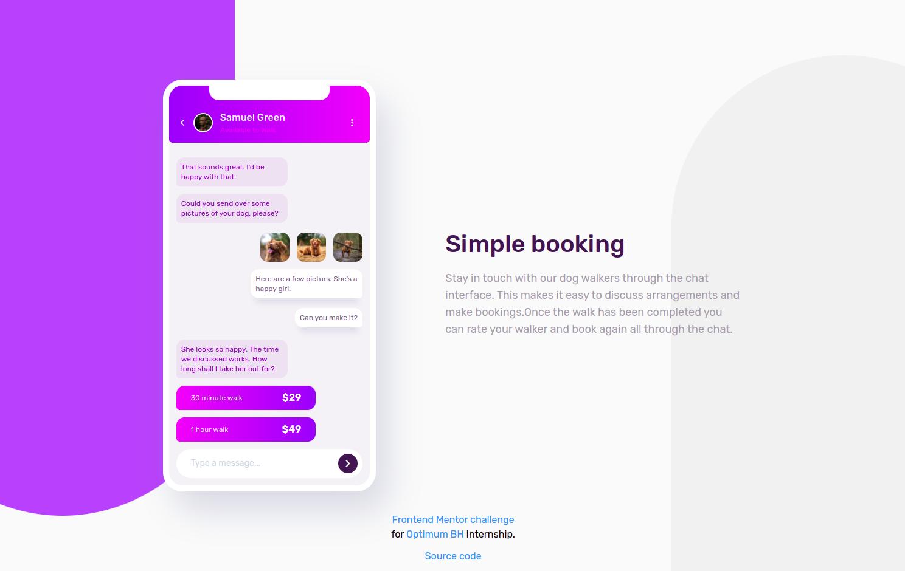
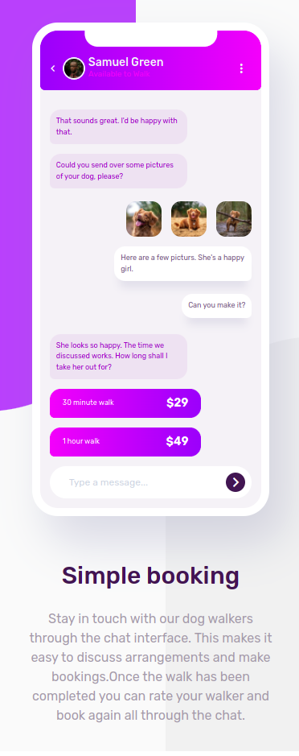

# Frontend Mentor - Chat app CSS illustration solution 👋

This is a solution to the [Chat app CSS illustration challenge on Frontend Mentor](https://www.frontendmentor.io/challenges/chat-app-css-illustration-O5auMkFqY). Frontend Mentor challenges help you improve your coding skills by building realistic projects.

## Table of contents

- [Frontend Mentor - Chat app CSS illustration solution 👋](#frontend-mentor---chat-app-css-illustration-solution-)
  - [Table of contents](#table-of-contents)
  - [Overview](#overview)
    - [The challenge](#the-challenge)
    - [Screenshot](#screenshot)
    - [Links](#links)
  - [My process](#my-process)
    - [Built with](#built-with)
    - [What I learned](#what-i-learned)
    - [**Example:**](#example)
    - [Continued development](#continued-development)
    - [Useful resources](#useful-resources)
  - [Author 🚀](#author-)

## Overview

### The challenge

Users should be able to:

- View the optimal layout for the component depending on their device's screen size
- **Bonus**: See the chat interface animate on the initial load

### Screenshot

Desktop design



- Mobile responsive design



---

### Links

- Solution URL: [Add solution URL here]()
- Live Site URL: [Add live site URL here]()

## My process

### Built with

- Semantic HTML5 markup
- CSS custom properties
- Flexbox model
- Mobile friendly responsive design
- Tailwind utility-first CSS framework (ver. 3+)

### What I learned

- [x] Improved my existing HTML/CSS knownledge
- [x] Tailwind CSS framework fundamentals, guide principles

Configuring and customizing my Tailwind installation:

### **Example:**

> **Creating your own classes:**

```css
/* your input style.css */
@tailwind base;
@tailwind components;
@tailwind utilities;
@layer components {
  /* custom css class */
  .chat-left {
    @apply mobile:text-xs bg-chat-bg-l text-prim-mod-violet rounded-tl-[0.85rem] rounded-tr-[0.85rem] rounded-br-[0.85rem] rounded-bl-md text-[9px] opacity-0;
  }
}
```

> **Usage:**

```html
<!-- Inside html file -->
...

<div
  class="animate-chat-left chat-left mobile:max-w-[60%] my-3 w-max max-w-[68%] p-2"
>
  That sounds great. I'd be happy with that.
</div>

...
```

> **Tailwind configuration file:**

_Custom font colors_

```js
module.exports = {
  content: ['./index.html'],
  theme: {
    extend: {

      //...

      fontFamily: {
        rubik: ['Rubik', ...defaultTheme.fontFamily.sans],
      },

      //...

    }
  },
  ...
}
```

### Continued development

---

### Useful resources

- [Tailwind wes site](https://tailwindcss.com/) - This helped me with fundamental principles of styling. Very usefull resource that comes with tailwind playground
- [Tailwind CSS playground.](https://play.tailwindcss.com/) - Nice place to practice with tailwind classes and quick design.
- [Tailwind CSS tutorial.](https://tsh.io/blog/tailwind-css-tutorial/) - A very hands-on approach to styling web applications.
-

## Author 🚀

- Website - [Daniel Molnar](https://github.com/Daniel4lm)
- Frontend Mentor - [@Daniel4lm](https://www.frontendmentor.io/profile/Daniel4lm)

---
