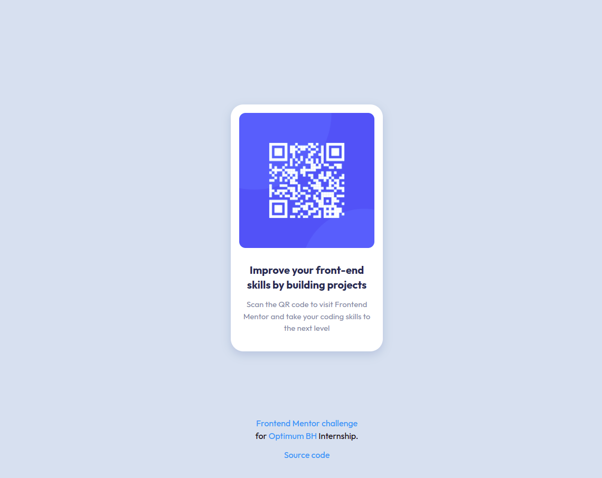

# Frontend Mentor - QR code component solution

This is a solution to the [QR code component challenge on Frontend Mentor](https://www.frontendmentor.io/challenges/qr-code-component-iux_sIO_H). Frontend Mentor challenges help you improve your coding skills by building realistic projects.

## Table of contents

- [Frontend Mentor - QR code component solution](#frontend-mentor---qr-code-component-solution)
  - [Table of contents](#table-of-contents)
  - [Overview](#overview)
    - [Screenshot](#screenshot)
    - [Links](#links)
  - [My process](#my-process)
    - [Built with following web technologies](#built-with-following-web-technologies)
    - [What I learned](#what-i-learned)
    - [**Example:**](#example)
    - [Continued development](#continued-development)
    - [Useful resources](#useful-resources)
  - [Author](#author)

## Overview

### Screenshot

- Desktop design



- Mobile responsive design


---

### Links

- Solution URL: [Add solution URL here](https://your-solution-url.com)
- Live Site URL: [Add live site URL here](https://your-live-site-url.com)

## My process

### Built with following web technologies

- Semantic HTML5 markup
- CSS custom properties
- Flexbox model
- Mobile friendly responsive design
- Tailwind utility-first CSS framework (ver. 3+)

### What I learned

- [x] Improved my existing HTML/CSS knownledge
- [x] Tailwind CSS framework fundamentals, guide principles

Configuring and customizing my Tailwind installation:

### **Example:**

> **Creating your own classes:**

```css
/* your input style.css */

@tailwind base;
@tailwind components;
@tailwind utilities;

@layer components {
  /* custom css class */
  .qr-card {
    @apply ... flex w-max flex-col items-center;
    box-shadow: 0 6px 18px 0 #b4c7df;
  }
}
```

> **Usage:**

```html
<!-- Inside html file -->
...

<div class="qr-card">...</div>
```

> **Tailwind configuration file:**

```js

module.exports = {
  content: ['./index.html'],
  theme: {
    extend: {
      colors: {
        'optimum-blue': '#009efc',
        'optimum-darkblue': '#0389e1',
        ...
      },
      ...
    }
  },
  ...
}
```

### Continued development

---

### Useful resources

- [Tailwind wes site](https://tailwindcss.com/) - This helped me with fundamental principles of styling. Very usefull resource that comes with tailwind playground
- [Tailwind CSS playground.](https://play.tailwindcss.com/) - Nice place to practice with tailwind classes and quick design.
- [Tailwind CSS tutorial.](https://tsh.io/blog/tailwind-css-tutorial/) - A very hands-on approach to styling web applications.

## Author

- Website - [Daniel Molnar](https://github.com/Daniel4lm)
- Frontend Mentor - [@Daniel4lm](https://www.frontendmentor.io/profile/Daniel4lm)

---
